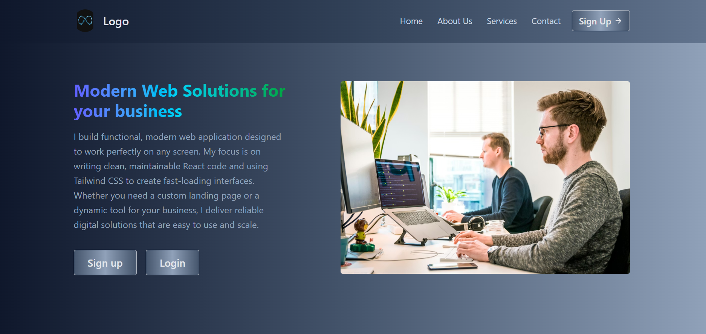

# [Project Name] - Portfolio Landing Page

 A high-performance, mobile-first landing page for a modern SaaS dashboard.

## 🔗 Live Demo
https://a-modern-light-dark-mode-landing-pa.vercel.app/

## 📸 Preview

## 🚀 Features
* *Responsive Design:* Optimized for all screen sizes using Tailwind breakpoints.
* *Semantic HTML:* Fully accessible structure for screen readers and SEO that scored 92 in SEO and 100 in accessibility on Lighthouse.
* *Smooth Navigation:* Integrated smooth-scroll for a seamless user experience.
* *Performance Focused:* Achieving 100/100 on Lighthouse audits.

## 🛠️ Tech Stack
* *Frontend:* React, Tailwind CSS
* *Build Tool:* Vite
* *Deployment:* [Vercel / GitHub Pages]

## 💻 Getting Started
 Go and check the Clone and repository: git clone :
 (https://github.com/abdulwasi-coder/A-modern-light-dark-mode-Landing-Page)

## 🧠 What I Learned
During this project, I focused on improving my *Tailwind CSS* efficiency and ensuring the site follows *Semantic HTML* standards for better SEO.